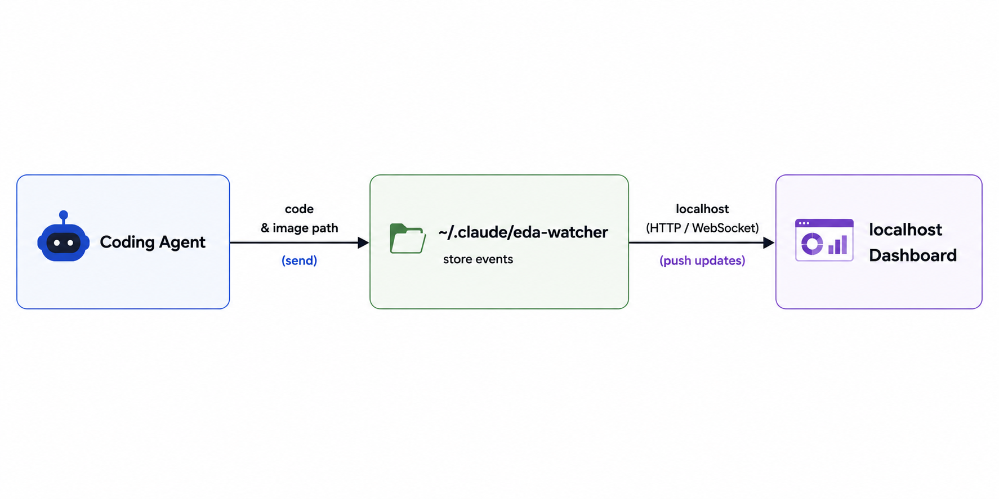
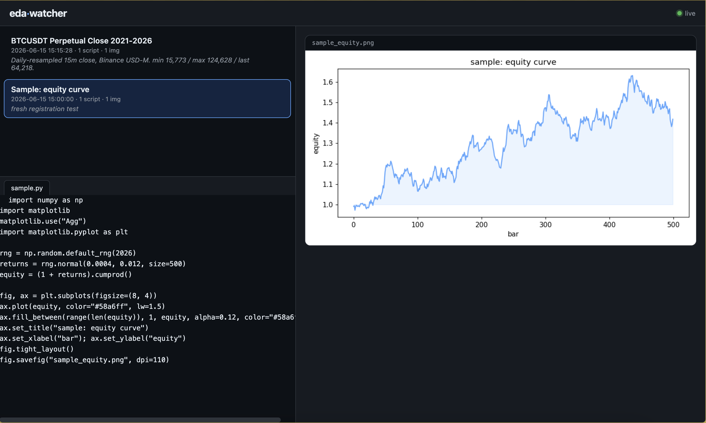

# eda-watcher

> **Currently Claude Code only.**



Local 2-panel research board to view agent session artifacts.

When Claude Code writes a plot while coding, both the image and the
throwaway script that made it usually land in a tmp job dir that gets
auto-cleaned the moment the session ends — gone before you ever look at
them. This board catches them while they still exist: the Python scripts
on the left, the images they produced on the right, in your browser.



- **Artifact-safe.** The server never touches your script/image files. The
  only write it performs is removing an entry from the manifest when you
  click the `×` button on a card.
- **Zero dependencies.** Python 3.7+ stdlib HTTP server + vanilla HTML/JS;
  no pip installs.
- **Path-agnostic.** Artifacts can live anywhere (tmp, worktree, repo) —
  they are referenced by absolute path in a manifest.

## Setup

```bash
git clone https://github.com/cityho/eda-watcher
cd eda-watcher
bash install.sh        # registers eda-watcher in your global ~/.claude/CLAUDE.md
python serve.py        # start the board -> http://127.0.0.1:8765
```

`install.sh` writes a usage guide to `~/.claude/eda-watcher.md` and imports
it from `~/.claude/CLAUDE.md` via an `@eda-watcher.md` line (the file Claude
Code loads into every project session), so from then on Claude — in any
project — knows to append its research plots to the shared manifest. It is
idempotent: re-running refreshes the guide and won't duplicate the import.
The board itself is a single process you keep running locally; every
project writes to the one global manifest, so they all show up here.

## Run

```bash
python serve.py                       # http://127.0.0.1:8765
python serve.py --port 9000 --host 0.0.0.0
```

Open the printed URL. The page polls the manifest every 3s, so new entries
appear without reloading.

## Manifest

Single source of truth. Entries are appended by Claude during research;
the board removes entries when you click `×` on a card (entry only — the
files it references stay on disk).

```
~/.claude/eda-watcher/manifest.json
```

A JSON array of entries:

```json
[
  {
    "id": "rsi-ma-sweep-4yr",
    "title": "RSI x MA sweep (4yr)",
    "created": "2026-06-15T10:30:00",
    "scripts": ["/abs/path/sweep.py", "/abs/path/helper.py"],
    "images": ["/abs/path/a.png", "/abs/path/b.png"],
    "note": "optional one-liner"
  }
]
```

- `id` — unique slug. Re-appending the same `id` replaces that entry
  (idempotent re-runs).
- `created` — ISO timestamp; the board sorts newest-first by this.
- `scripts` / `images` — **absolute** paths. Multiple scripts render as
  sub-tabs in the code panel.
- Paths must appear here to be servable — the server refuses (`403`) any
  path not in the manifest, so it cannot be used to read arbitrary files.

### For Claude: how to append an entry

```python
import json, os, datetime
from pathlib import Path

mpath = Path(os.path.expanduser("~/.claude/eda-watcher/manifest.json"))
mpath.parent.mkdir(parents=True, exist_ok=True)
entries = json.loads(mpath.read_text()) if mpath.exists() else []
entries = [e for e in entries if e["id"] != "my-id"]  # idempotent replace
entries.append({
    "id": "my-id",
    "title": "Human readable title",
    "created": datetime.datetime.now().isoformat(timespec="seconds"),
    "scripts": [os.path.abspath("sweep.py")],
    "images": [os.path.abspath("out.png")],
    "note": "",
})
mpath.write_text(json.dumps(entries, indent=2))
```

## Test

```bash
pytest test_serve.py -v
```

## Behavior on missing files

If an artifact path is gone from disk (e.g. a tmp file was auto-cleaned),
the entry stays in the manifest; the board shows a "file not found"
placeholder for that item instead of crashing. Nothing is auto-removed.
